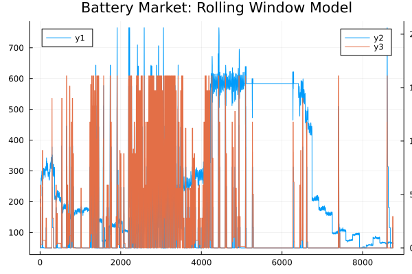

# BatteryMarket.jl

<div align="center">
    
</div>

## Getting Started

### Install
```julia
pkg> add https://github.com/psrenergy/BatteryMarket.jl
```

### Using
The basic file structure to use this project is as follows:
```
|__ folder
    |__ battery.toml
    |__ model.toml
    |__ data.csv
```

`.toml` files can be ignored by writing an underscore `_` before the file name as in `"_battery.toml"` and `"_model.toml"`.
To run a simulation based on `data.csv` and the configuration files one must do:
```julia
julia> import BatteryMarket

julia> BatteryMarket.simulate(basepath="path/to/folder")
```
or via the command-line interface:
```bash
$ julia -e 'import BatteryMarket; BatteryMarket.simulate(basepath="path/to/folder")'
```
if `basepath` is not provided, defaults to the current directory (`pwd()`).

this will produce the `"results.csv"` file:
```
|__ folder
    |__ battery.toml
    |__ model.toml
    |__ data.csv
    |__ results.csv
```

### `model.toml`
```toml
[Model]
model_type = "base"
    
[Model.Window]
num_windows   = 365
window_size   = 24  # hours
forecast_size = 24  # hours
```

The `model_type` key must be either the `"base"` or `"connected"`. The `[Model.Window]` block introduces the Rolling Window Model, where `num_windows`, `window_size` and `forecast_size` must be set.

### `battery.toml`
```toml
[[Battery]]
code = 32
charge_eff = 0.9
discharge_eff = 0.98
max_storage = 20.6
max_charge = 2.1
max_discharge = 1.9
initial_charge = 0.0

[[Battery]]
code = 33
charge_eff = 0.92
discharge_eff = 0.96
max_storage = 16.1
max_charge = 3.2
max_discharge = 2.8
initial_charge = 0.0
```

### `data.csv`
The `"base"` model requires the price (`"p"`) column to be present and the `"connected"` one requires both price and available energy (`"E"`) columns.

#### `"base"`:
|p     |
|:----:|
|204.37|
|206.82|
|204.61|
|209.20|
|207.19|
|201.99|
|195.53|
|195.40|
|195.50|
|198.80|

#### `"connected"`:
|p     |E   |
|:----:|:--:|
|204.37|2.12|
|206.82|1.92|
|204.61|0.78|
|209.20|0.00|
|207.19|0.00|
|201.99|0.00|
|195.53|0.00|
|195.40|0.12|
|195.50|0.09|
|198.80|0.32|

### `results.csv`
|p     |charge_32|charge_33|charge_delta_32|charge_delta_33|operation_32|operation_33|
|:----:|:-------:|:-------:|:-------------:|:-------------:|:----------:|:----------:|
|204.37|-0.0     |-0.0     |0.0            |0.0            |0.0         |0.0         |
|206.82|-0.0     |-0.0     |0.0            |0.0            |0.0         |0.0         |
|204.61|-0.0     |-0.0     |0.0            |0.0            |0.0         |0.0         |
|209.20|-0.0     |-0.0     |0.0            |0.0            |0.0         |0.0         |
|207.19|-0.0     |-0.0     |0.0            |0.0            |0.0         |0.0         |
|201.99|-0.0     |-0.0     |0.0            |0.0            |0.0         |0.0         |
|195.53|0.04     |-0.0     |0.04           |0.0            |-8.69       |0.0         |
|195.40|1.93     |2.94     |2.10           |3.2            |-410.34     |-625.28     |
|195.50|3.82     |5.89     |2.10           |3.2            |-410.55     |-625.6      |
|198.80|3.82     |5.89     |0.0            |0.0            |0.0         |0.0         |
